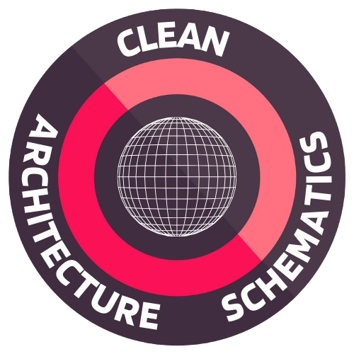

# Clean Architecture Generator

Clean Architecture Generator is a CLI tool designed to help developers generate clean architecture templates and view-models for their projects.



## Features

- **Generate Clean Architecture Template**: Automatically create the folder structure for clean architecture projects (`domain`, `application`, `infrastructure`, and `gateways`).
- **Generate View-Model**: Create a new ViewModel with the required structure.

## Usage

First of all, it is used in Angular projects with the Jest testing library.

1. Use the comand clean-arq-schematics in the folder that we want to generate the schematics

2. A list of actions will be displayed: 'New view-model', 'Generate clean architecture template', choose one of them and enjoy!

## Installation

To install the tool globally from npm:

```bash
npm install -g clean-architecture-generator
